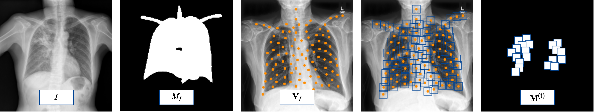

# MICCAI2025

Anonymous repository for the MICCAI 2025 submission.

This study aims to develop and validate a transformer-based algorithm that predicts radiological errors in chest X-ray interpretation by analyzing longitudinal gaze patterns and image data. 

## Repository Structure

```
├── data/                  # Data loading and preprocessing scripts
├── requirements.txt       # Python dependencies
└── README.md              # Project overview
```


## Getting started

**1.** You will need two types of data: fixation points (x, y) and chest X-ray images. If you have raw gaze data, it needs to be processed to identify fixations (i.e., moments when the gaze is relatively stable), as the number of (x, y) points in a file will affect computation time. You may use any fixation detection method. One commonly cited approach is:

> Dario D. Salvucci and Joseph H. Goldberg (2000). Identifying Fixations and Saccades in Eye-Tracking Protocols.

**2.** The next step is to prepare anatomical patches corresponding to specific regions of the chest X-ray images. This is done by running the script located at: 

```
data/main.py
```



This script will:

* Load chest X-ray images located in the ```IMAGE_PATH``` directory. An example image is referred to as _I_ in the figure.
* Generate segmentation masks (referred to as _M_ with a subscript _I_ in the figure) based on anatomical structures, please see [PSPNet](https://github.com/mlmed/torchxrayvision). The generated masks will be saved in the ```OUTPUT_DIR_FOR_MASKS``` directory.
* Generate anatomical patches and save them in the ```ANATOMICAL_PATH``` directory. This intermediate stage is indicated as _V_ with subscript _I_ in the figure. The script also computes a set of patches considered important (denoted as _M_ with superscript _(t)_).
* Optional: To accelerate processing, the script can use the ```ray``` library for parallel execution. However, this is not required. If you encounter issues or prefer to run the script without parallelism, you can simply comment out the relevant lines involving ```ray```. 
  
**3.** For Reading features calculation run ```python data/reading_features.py```. The script will use fixation points (x,y) and generated segmentation masks.

